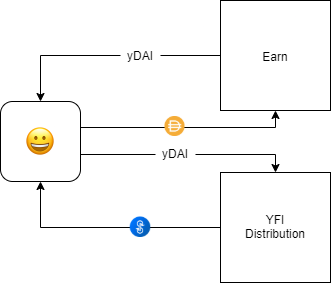

# Yearn Governance

### Process

In Yearn Governance a Yearn Improvement Proposal \(YIP\) is how features are added to the Yearn ecosystem. Users start a proposal on the [forum](https://gov.yearn.finance/), discuss it, and if many users agree with the proposal, it's moved to Snapshot for polling and an official vote. Here is the life cycle of a YIP: 

```text
Proposed -> Approved -> Implemented
  ^                     |
  +----> Rejected       +----> Moribund
  |
  +----> Withdrawn
  v
Deferred
```

You can find a full list of Approve, Implemented, and Rejected YIPs here: [https://yips.yearn.finance/all-yip](https://yips.yearn.finance/all-yip)

### YFI 

The YFI token is the centerpiece of Yearn Governance. YFI was [announced](https://medium.com/iearn/yfi-df84573db81) on July 17, 2020 in effort to hand control of Yearn over to its community. Each of Yearn's products have control mechanisms: configurable fees, maintenance controls, and rules that can be modified. Until the launch of YFI, these were centrally managed—now they are managed by YFI holders. 

Unlike many token distributions YFI had no pre-mine, no sale, and no auction to buy it. You had to _earn_ YFI through a "liquidity mining" program. In order to earn YFI, users provided liquidity to one of Yearn's products, staked the output tokens in the YFI distribution contracts, and earned a \(governance controlled\) amount of YFI per day: 



The liquidity mining program ran until the predetermined supply cap of 30,000 YFI tokens were distributed. It is up to governance to decide if more YFI will be minted in the future. That said: future minting of YFI seems unlikely based on past proposals and a [proposal](https://gov.yearn.finance/t/burn-yfi-minting-ability-permanently/5377) to burn YFI's minting ability. [YFI token contract](https://etherscan.io/token/0x0bc529c00C6401aEF6D220BE8C6Ea1667F6Ad93e). 

For a summary of YFI's metrics and risks, read MakerDAO's [Collateral Onboarding Risk Evaluation](https://forum.makerdao.com/t/yfi-collateral-onboarding-risk-evaluation/4575). 

### Governance Staking / Voting

There are two primary actions a YFI holder needs to take to participate in Yearn governance: staking and voting. 

#### 🥩 Staking

Governance staking requires you to stake \(i.e. deposit\) your YFI into the [Governance contract](https://etherscan.io/address/0xBa37B002AbaFDd8E89a1995dA52740bbC013D992). By staking your YFI, you're entitled to a percentage of the profits generated by the Yearn system—proportional to your stake—_and_ you receive voting rights on governance decisions. 

To stake your YFI just head over to the [staking portal](https://ygov.finance/). This is also where you claim your governance rewards. It's an easy process and you'll be ready to go with a few button clicks. 

#### 🗳️ Voting

Once you've staked your YFI you're eligible to vote on governance decisions. Your vote's influence on a governance poll is proportional to your stake. 

To lessen the burden of fees on smaller holders, Yearn governance voted to move fully to off-chain voting hosted by Snapshot. Snapshot is an off-chain gasless multi-governance client with easy to verify and hard to contest results. It makes creating and voting on proposals free with similar benefits to on chain voting.

When a proposal is up for a vote, it must meet quorum requirements \(&gt;20% of the tokens staked in the governance contract\) and generate a majority support \(&gt;50% of the vote\) before it is implemented by the 9 member multi-signature wallet. Changes must be signed by 6 out of the 9 wallet signers in order to be implemented.

Finding previous / active polls and casting your vote is easy; just head the [Yearn Snapshot Portal](https://yearn.snapshot.page/#/yearn/all). 

### Yearn Multisig 

The Yearn Multisig was enacted through [YIP 41](https://yips.yearn.finance/YIPS/yip-41), which proposed to temporarily empower the Multisig members to make basic, limited operational decisions including budgetary expenditures, protocol grants, and hiring for six months, as we prepared a more robust governance architecture.

In this nascent stage of Yearn’s lifetime, it is crucial to make rapid decisions in order to establish a strong foundation. Structure and support needs to be quickly built around Yearn’s development speed in order to ensure the success of the protocol. This proposal formalized administrative roles that serve as a foundation for the protocol’s transition to a multi-DAO structure in the near term.

Read the full proposal [here](https://yips.yearn.finance/YIPS/yip-41) and learn more about the awesome team enabled by the Multisig [here](https://docs.yearn.finance/additional-resources/team). 


